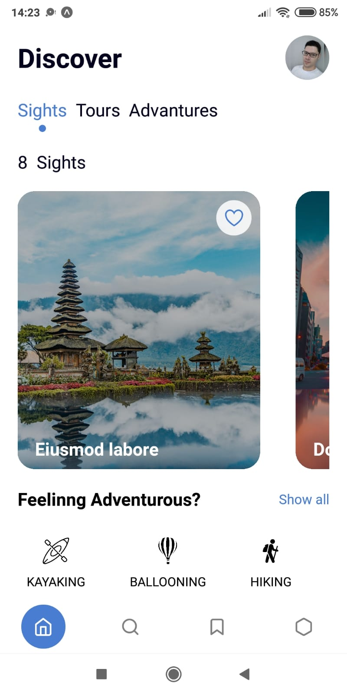
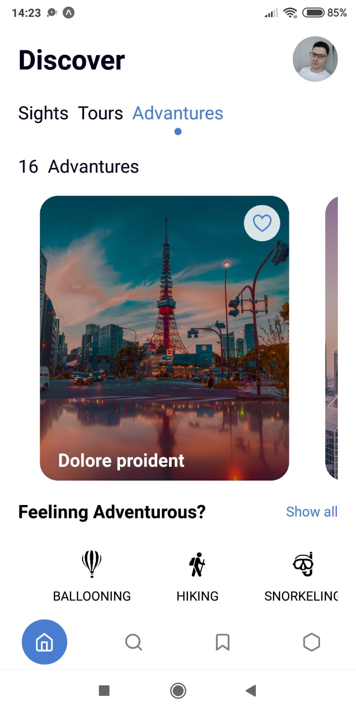

<h1 align="center">✈️ App Travel ✈️</h1>

  
  

> Tela Home de um App de viagem.

## :page_facing_up: Explicação

O projeto foi desenvolvido utilizando a biblioteca [React-native](https://reactnative.dev/) e estilizado com StyleSheet.

## 🚀 Tecnologias ##

- [React-native](https://reactnative.dev/)
- [React Hooks](https://pt-br.reactjs.org/docs/hooks-intro.html)
- [Expo](https://expo.dev/)

## 🤝 Colaboradores

Agradecemos às seguintes pessoas que contribuíram para o projeto:

<table>
  <tr>
    <td align="center">
      <a href="#">
         
        
          <b>Antônio Marcelino</b>
        
      </a>
    </td>
  </tr>
</table>

&#xa0;

<a href="#top">Voltar para o topo</a>
